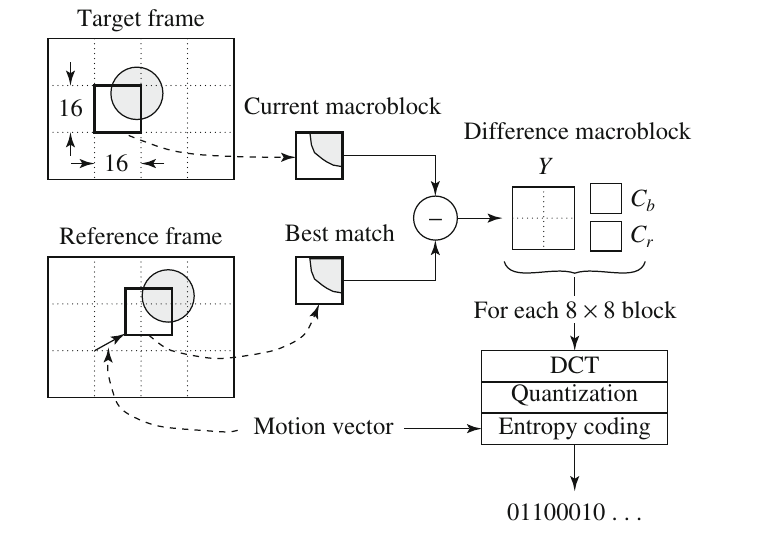

# Wavelet-Based Coding

* decompose input signal
  * 分解成較好處理
  * 或特殊處理
  * 或Threshold（去極）

## Continuous Wavelet Transform

* integral  f\(x\)  = 0
* mother wavelet \(母小波\) : 用於 scaling
* 

## Discrete Wavelet Transform

* 一樣有 mother wavelet transform
* filter banks
* 

以 2 的倍數去做平移、縮放

### multi-resolution analysis

* 將訊號分成兩大部份
  * smoother
    * scaling function
  * coarser
    * wavelet function

#### scaling function

* dilation function
* 

block diagram​ of 1D Dyadic Wavelet Transform

