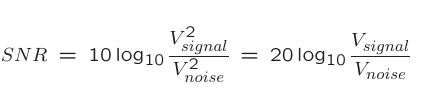
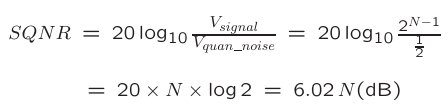
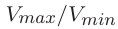
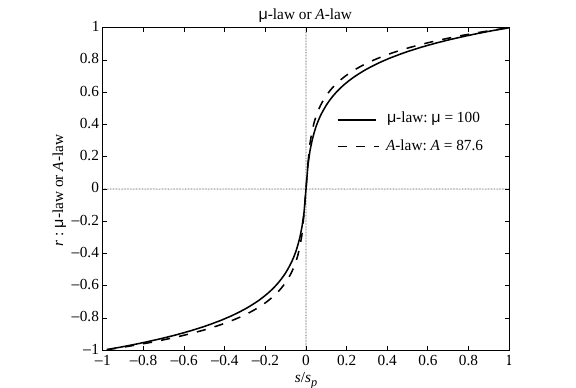
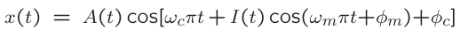

# Digitization of Sound

## Digitization of Sound

### Digitization

將類比訊號轉為數位的過程

a. 取樣 （sampling）

Sampling frequency

* audio 8k~48k \(Nyquist theory\)

b. 量化程度

uniform？non-uniform？

c. 檔案格式

.wav？ .mp3？

### Nyquist theory

### Signal to Noise Ratio\(SNR\)

### Signal to Quantization Noise Ratio \(SQNR\)

* 量化時造成的誤差
* 
* dynamic range
  * 

## Quantization

### Linear quantization

### Non-uniform quantization

* weber's law
* * * * 

## Audio Filter

* band-pass filter

### Synthetic Sounds

#### FM \(Frequency Modulation\)

* 調頻
* 

#### Wave Table Synthesis

