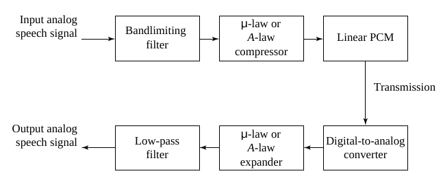
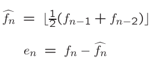
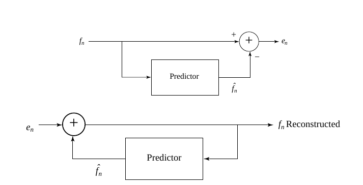
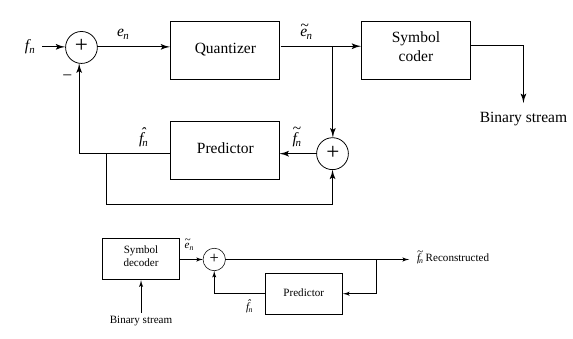

# Quantization and Transmission of Audio

* Coding of Audio

-

* PCM: Pulse Code Modulation
* DPCM \(Differential\)
* ADPCM \(adaptive\)

—

## Pulse Code Modulation

* 壓縮
  * Transformed
  * loss
  * Coding

### PCM in Speech Compression

### Differential Coding of Audio

* 利用差值
  * 訊號的變化有連續性，不會大跳
* Lossless Predictive Coding
  * 以前面幾個時間點的值預測下一個時間點的值
  * 問題：最壞的情況下，Dynamic range會增加
    * Shift-up
    * Shift-down
  * 
  * -

### Differential PCM \(DPCM\)

-

### DM \(Delta MOdulation\)

